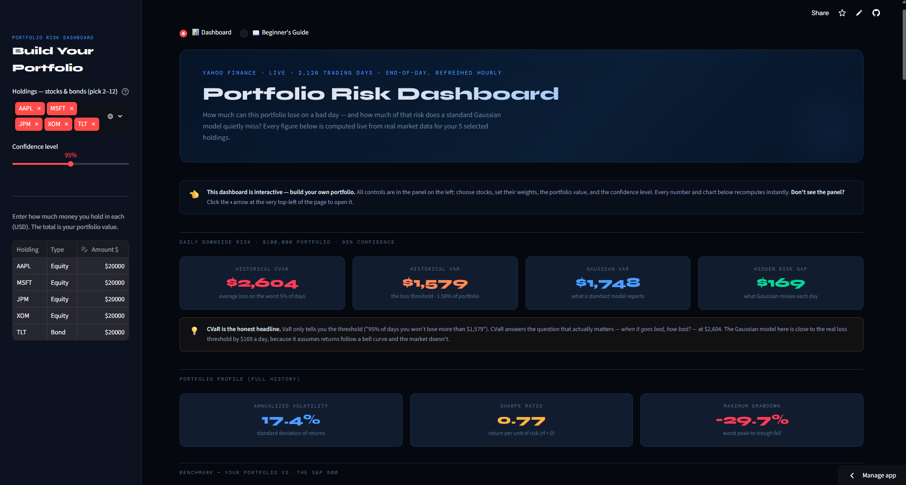
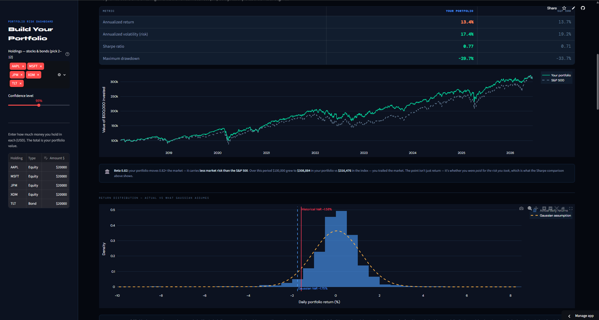
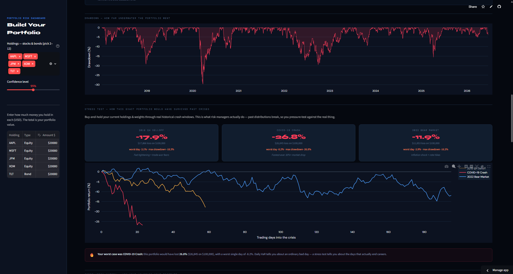
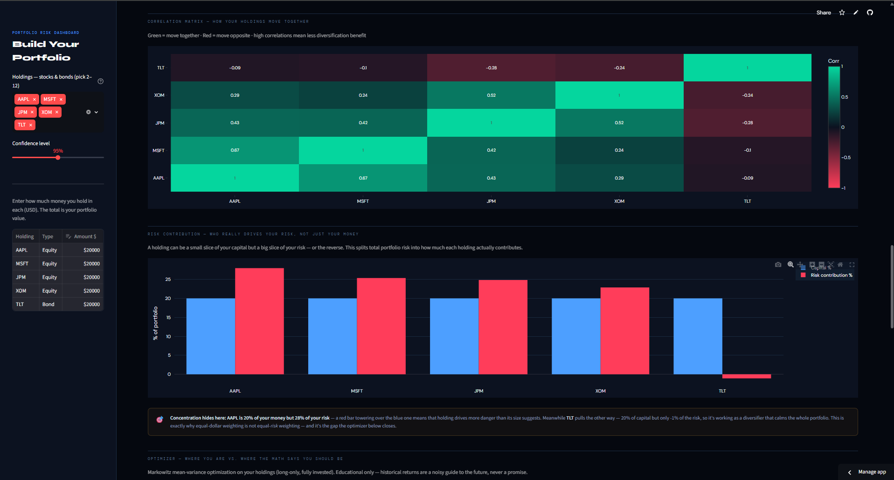
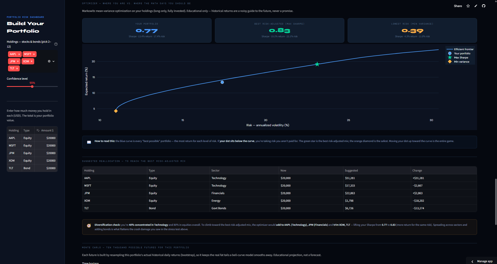

# Portfolio Risk Dashboard

A web application for measuring and explaining portfolio risk. It computes institutional-grade
downside-risk metrics, runs historical crisis stress tests, performs Markowitz optimization and
Monte Carlo simulation, and benchmarks a portfolio against the S&P 500 — with every metric
explained in plain language.

**Live application:** https://icn93ppxyjtbgd5sxdjvpb.streamlit.app/

> Educational risk simulator. Not financial advice.



## Features

Portfolios are constructed from US large-cap equities and bond ETFs using actual dollar
amounts. The application provides:

- **Risk metrics** — Historical VaR and CVaR, annualized volatility, Sharpe ratio, maximum
  drawdown, a holdings correlation heatmap, and the divergence between empirical fat-tailed
  returns and a Gaussian model.
- **Crisis stress testing** — Portfolio performance through the 2018 Q4 selloff, the COVID-19
  crash, and the 2022 bear market, reporting total loss, worst single day, and maximum drawdown
  for each event.
- **Markowitz optimization** — The efficient frontier, maximum-Sharpe and minimum-variance
  portfolios, and a suggested reallocation with a diversification assessment.
- **Monte Carlo simulation** — 10,000 bootstrap paths over a configurable horizon, an outcome
  cone, and probabilities of loss and of significant gain.
- **S&P 500 benchmark** — Growth-of-capital comparison, beta, and a risk-adjusted performance
  assessment.
- **Risk contribution analysis** — Component contribution to total portfolio risk, identifying
  the primary risk drivers and the holdings that provide diversification.
- **Beginner's Guide** — An explanatory mode that defines every metric in plain language for
  non-specialist users.

## Screenshots

**Return distribution and S&P 500 benchmark** — empirical returns against the Gaussian
assumption, with growth-of-capital versus the benchmark.



**Crisis stress testing** — the portfolio's drawdown history and its performance through past
market crises.



**Risk contribution analysis** — correlation heatmap and each holding's share of capital versus
its share of total portfolio risk.



**Markowitz optimization** — the efficient frontier and a suggested reallocation table.



## Methodology

Standard risk models assume returns follow a normal distribution. Empirical returns do not:
losses are larger and more frequent than a bell curve predicts. The application leads with
historical, real-data measures and surfaces the gap against the Gaussian model, making the
tail risk that conventional tools understate explicit.

## Installation

```bash
pip install -r requirements.txt
python -m streamlit run app.py
```

Live prices are retrieved directly from the Yahoo Finance chart API via `urllib`. A frozen
snapshot (`prices.csv`) is included as a fallback, allowing the application to run without
external API keys.

## Tech Stack

Streamlit · NumPy · pandas · SciPy · Plotly. Data source: Yahoo Finance end-of-day prices.
