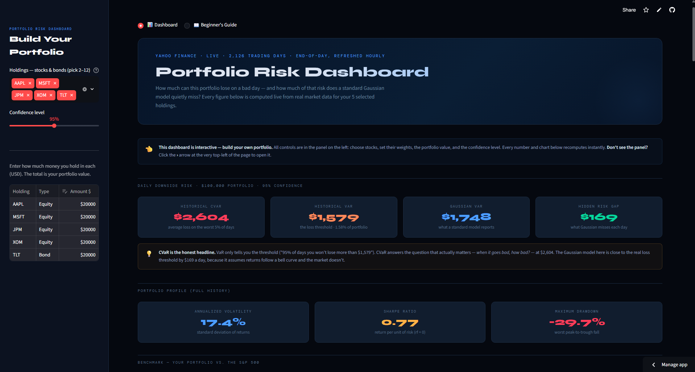
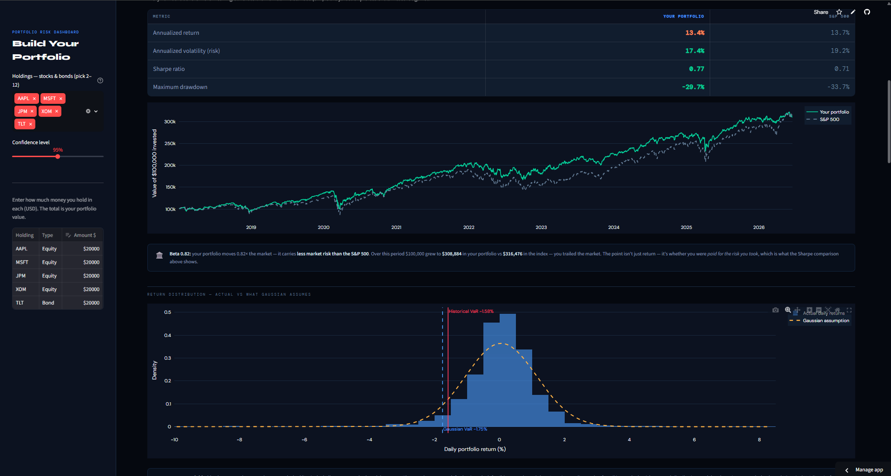
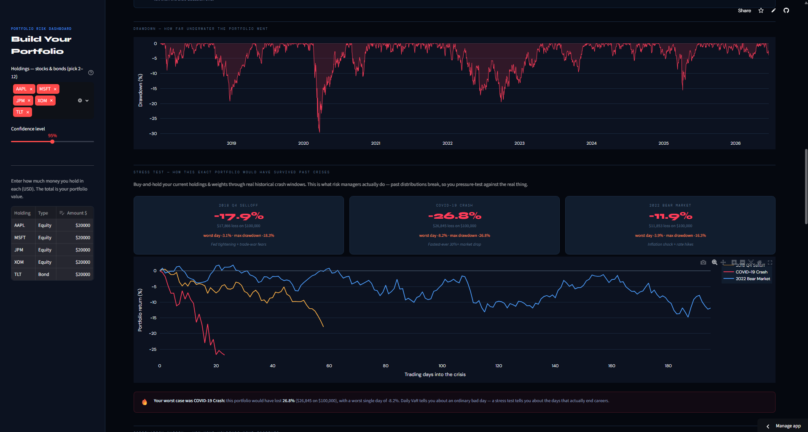
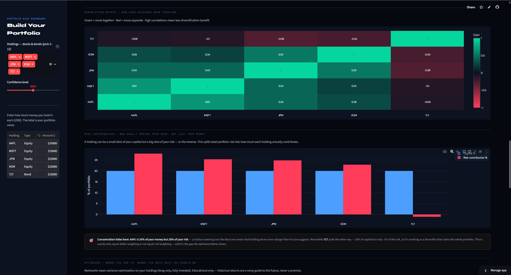
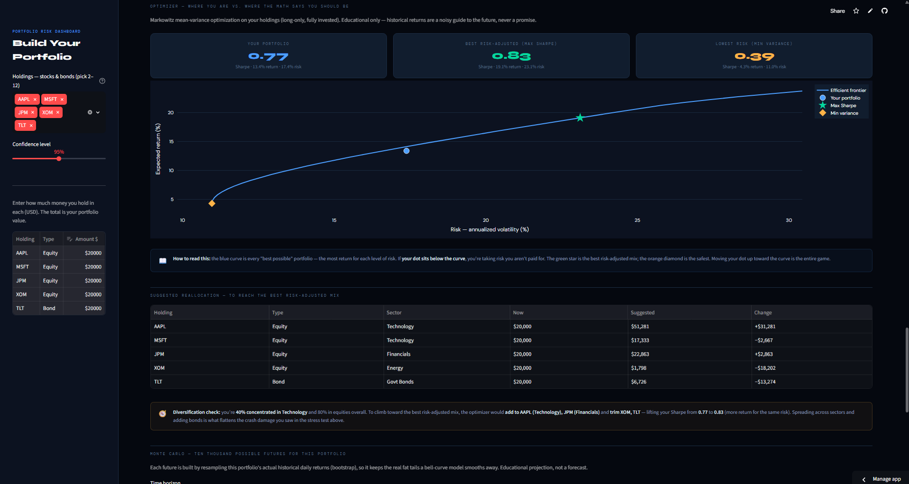

# Portfolio Risk Dashboard

A web application for measuring and explaining portfolio risk. It computes institutional-grade
downside-risk metrics, runs historical crisis stress tests, performs Markowitz optimization and
Monte Carlo simulation, and benchmarks a portfolio against the S&P 500 — with every metric
explained in plain language.

**Live application:** https://icn93ppxyjtbgd5sxdjvpb.streamlit.app/

> Educational risk simulator. Not financial advice.



## Features

Portfolios are constructed from US large-cap equities and bond ETFs using actual dollar
amounts. The application provides:

- **Risk metrics** — Historical VaR and CVaR, annualized volatility, Sharpe ratio, maximum
  drawdown, a holdings correlation heatmap, and the divergence between empirical fat-tailed
  returns and a Gaussian model.
- **Crisis stress testing** — Portfolio performance through the 2018 Q4 selloff, the COVID-19
  crash, and the 2022 bear market, reporting total loss, worst single day, and maximum drawdown
  for each event.
- **Markowitz optimization** — The efficient frontier, maximum-Sharpe and minimum-variance
  portfolios, and a suggested reallocation with a diversification assessment.
- **Monte Carlo simulation** — 10,000 bootstrap paths over a configurable horizon, an outcome
  cone, and probabilities of loss and of significant gain.
- **S&P 500 benchmark** — Growth-of-capital comparison, beta, and a risk-adjusted performance
  assessment.
- **Risk contribution analysis** — Component contribution to total portfolio risk, identifying
  the primary risk drivers and the holdings that provide diversification.
- **Beginner's Guide** — An explanatory mode that defines every metric in plain language for
  non-specialist users.

## Screenshots

**Return distribution and S&P 500 benchmark** — empirical returns against the Gaussian
assumption, with growth-of-capital versus the benchmark.



**Crisis stress testing** — the portfolio's drawdown history and its performance through past
market crises.



**Risk contribution analysis** — correlation heatmap and each holding's share of capital versus
its share of total portfolio risk.



**Markowitz optimization** — the efficient frontier and a suggested reallocation table.



## Methodology

Standard risk models assume returns follow a normal distribution. Empirical returns do not:
losses are larger and more frequent than a bell curve predicts. The application leads with
historical, real-data measures and surfaces the gap against the Gaussian model, making the
tail risk that conventional tools understate explicit.

### Model Validation

Value-at-Risk is only meaningful once it has been backtested. A 250-day rolling
window is walked across the full history; each day the realized loss is compared
to the VaR estimate to flag a breach. Two standard tests then judge the model:

- **Kupiec POF** (unconditional coverage) — is the breach *rate* consistent with
  the stated confidence level?
- **Christoffersen** (conditional coverage) — do breaches arrive independently, or
  cluster together in crises?

Historical and Gaussian VaR are scored side by side, exposing where the
normal-distribution assumption underestimates real tail risk. Fat-tailed
Student-t VaR/CVaR and Ledoit-Wolf covariance shrinkage are also available, the
latter producing more robust optimizer weights by shrinking the noisy sample
covariance toward a stable target.

### Factor Analysis

Portfolio returns are regressed on the Fama-French three factors — market (Mkt-RF),
size (SMB), and value (HML) — by ordinary least squares. The resulting betas expose
the portfolio's tilts (small- vs large-cap, value vs growth), the annualized alpha
measures return not explained by those factors, and R² measures how much of the
daily variation the model captures. Portfolio variance is then attributed across the
three factors and an idiosyncratic remainder. Factor data is a committed snapshot of
the Kenneth French daily series; the regression uses log excess returns against the
simple factor returns, a standard daily-frequency approximation.

## Installation

```bash
pip install -r requirements.txt
python -m streamlit run app.py
```

Live prices are retrieved directly from the Yahoo Finance chart API via `urllib`. A frozen
snapshot (`prices.csv`) is included as a fallback, allowing the application to run without
external API keys.

## Tech Stack

Streamlit · NumPy · pandas · SciPy · Plotly. Data source: Yahoo Finance end-of-day prices.

## Risk API (Phase 3)

A FastAPI service exposes the same tested risk engine over HTTP. `POST /analyze`
accepts a portfolio (ticker → dollar amount) and returns risk metrics, Fama-French
factor exposure, optimizer targets, and — optionally — VaR backtesting as JSON.
Portfolios can be saved and reloaded (`/portfolios`). Interactive documentation is
auto-generated at `/docs` (Swagger UI).

Run locally:

    pip install -r requirements-api.txt
    uvicorn api.main:app --reload
    # open http://localhost:8000/docs

**Notes.** Analysis uses the committed price snapshot (deterministic, no live
fetch in the request path). On the free-tier host the service sleeps when idle,
so the first request after a pause takes ~30–50s to wake. Saved portfolios use
SQLite on the host's ephemeral filesystem and do not persist across redeploys —
the persistence layer demonstrates the capability; a production deployment would
use a managed database.
